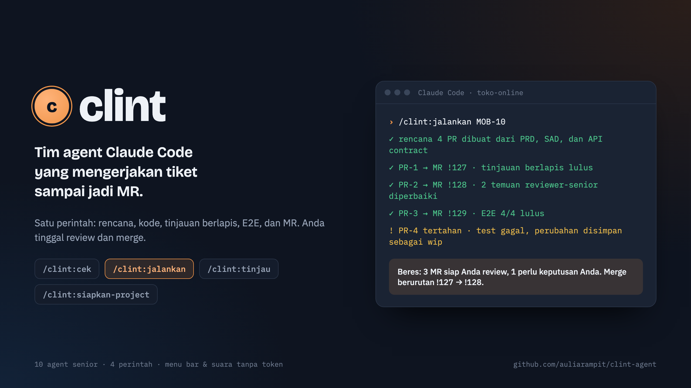
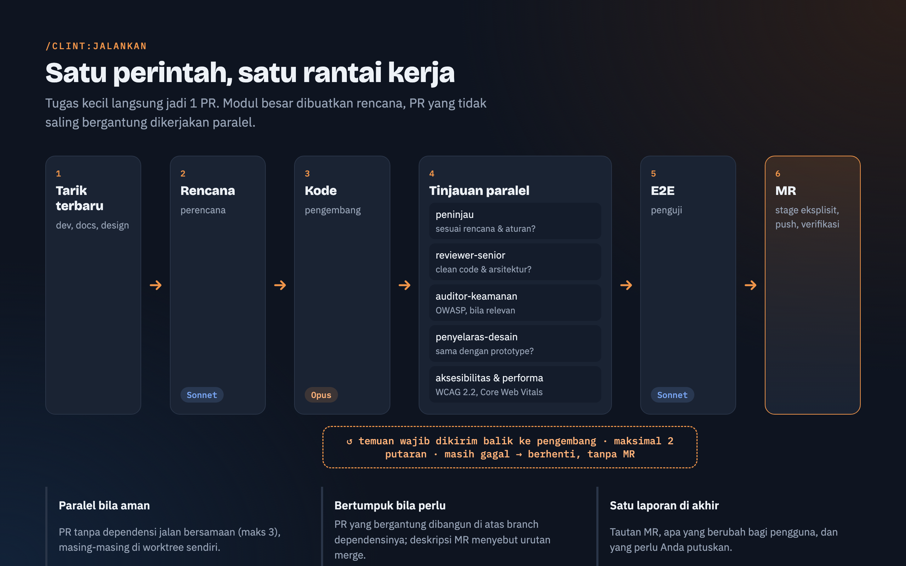
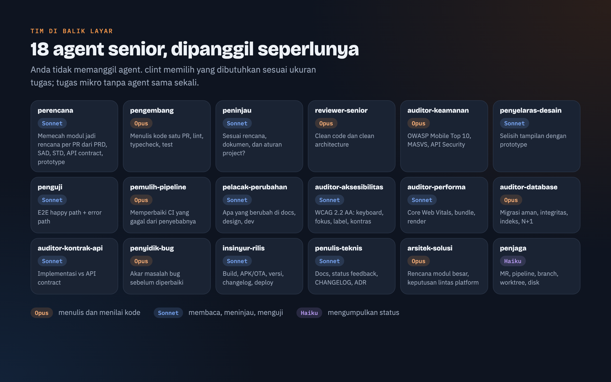
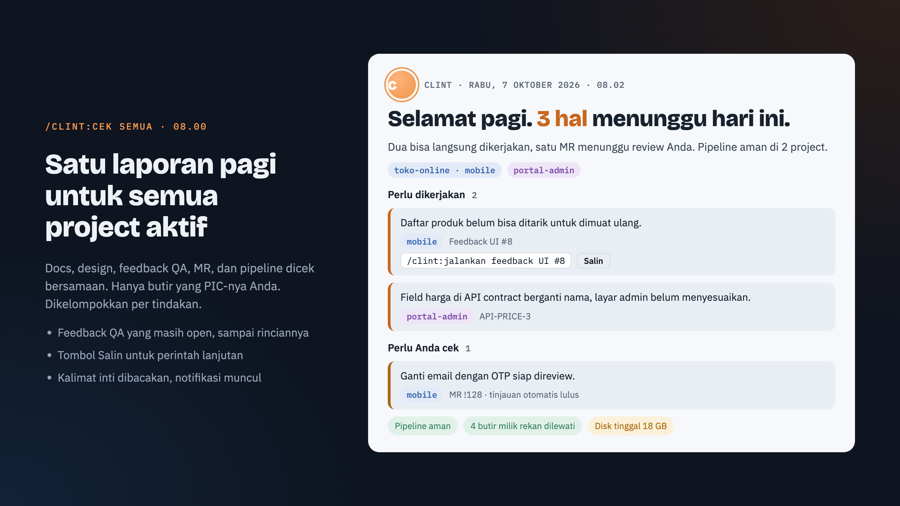
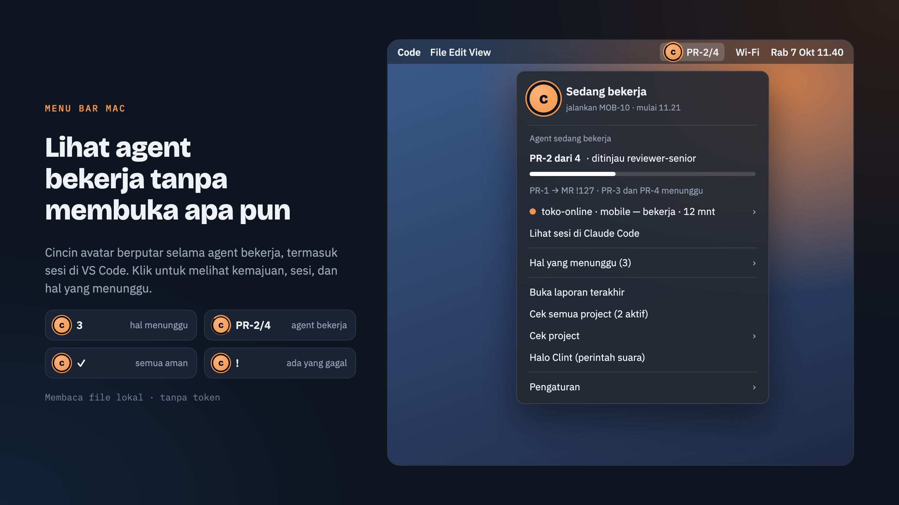
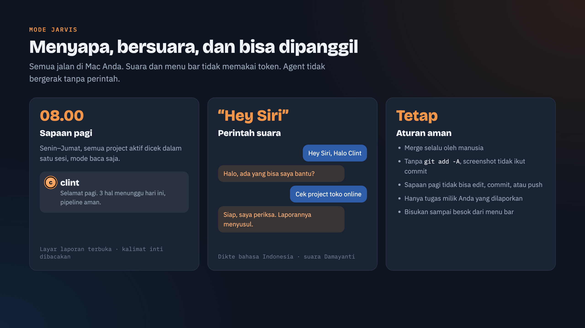

# clint



**clint** adalah plugin Claude Code berisi 18 agent senior yang bekerja sebagai satu tim: membaca
dokumen, merencanakan, menulis kode, meninjau berlapis, menguji, sampai membuat MR. Dipasang sekali,
berlaku di semua project. Anda cukup **review dan merge**.

- **Satu perintah untuk semua pekerjaan.** Tugas kecil langsung jadi 1 PR; modul besar dibuatkan
  rencana dan PR-nya dikerjakan paralel bila aman.
- **Tinjauan berlapis sebelum MR.** Kesesuaian dokumen, clean code, keamanan OWASP, aksesibilitas
  WCAG 2.2, performa, database, kontrak API, dan kesesuaian desain; temuan wajib diperbaiki otomatis.
- **Mobile, web, dan backend.** Skill platform yang portable: konvensi inti + adapter fakta stack per project.
- **Tahu kondisi kerja tanpa bertanya.** Laporan pagi gabungan, menu bar yang menampilkan agent yang
  sedang bekerja, kabar suara, dan perintah lewat "Hey Siri".
- **Hemat token.** Model tidak diturunkan; yang dijaga cara kerja agent. Menu bar, suara, dan
  pembaruan status tidak memakai token sama sekali.

---

## Daftar isi

1. [Mulai cepat](#mulai-cepat)
2. [4 perintah](#4-perintah)
3. [Cara kerja `jalankan`](#cara-kerja-jalankan)
4. [Tim agent](#tim-agent)
5. [Platform: mobile, web, backend](#platform-mobile-web-backend)
6. [Laporan pagi](#laporan-pagi)
7. [Menu bar](#menu-bar)
8. [Mode JARVIS](#mode-jarvis)
9. [Otomatis tanpa perintah](#otomatis-tanpa-perintah)
10. [Hemat token](#hemat-token)
11. [Konfigurasi](#konfigurasi)
12. [Struktur repo dan perawatan](#struktur-repo-dan-perawatan)
13. [Peta jalan](#peta-jalan)

---

## Mulai cepat

```bash
claude plugin marketplace add auliarampit/clint-agent
claude plugin install clint@clint
```

Lalu di VS Code: `Cmd+Shift+P` → **Developer: Reload Window**, buka sesi baru di project Anda, dan
jalankan sekali:

```
/clint:siapkan-project mobile      # atau: web, backend
```

Perintah ini menyalin skill dan rules platform ke `.claude/`, mengisi adapter stack dari hasil
verifikasi (bukan tebakan), dan membuat `.claude/clint.json`. Tidak ada yang di-commit; Anda periksa
dulu.

## 4 perintah

| Perintah | Untuk |
|---|---|
| `/clint:cek` | "Ada update apa?" Tarik docs dan design, cocokkan dengan kode, feedback QA yang masih open, MR, pipeline. `/clint:cek semua` untuk semua project aktif sekaligus |
| `/clint:jalankan <apa yang mau dikerjakan>` | **Semua pekerjaan**, dari perbaikan kecil sampai modul penuh. Hasil: MR + satu laporan |
| `/clint:tinjau !123` | Review MR rekan (hanya laporan, tanpa mengubah kode) |
| `/clint:siapkan-project` | Sekali per project. `sinkron` untuk membandingkan salinan dengan master |

Anda **tidak perlu memanggil agent**; perintah di atas yang menugaskan mereka.

```
/clint:jalankan perbaiki daftar produk: tambah tarik-untuk-muat-ulang   ← tugas kecil, 1 PR
/clint:jalankan MOB-10                                                 ← modul baru, rencana dibuat otomatis
/clint:jalankan docs/plans/mob-10.md                                   ← lanjutkan rencana (PR selesai dilewati)
/clint:jalankan docs/plans/mob-10.md PR-5..PR-7                        ← sebagian PR saja
/clint:jalankan ../docs/qa/feedback-ui.md                              ← butir feedback/bug yang masih open
/clint:jalankan terapkan saran reviewer 1 dan 2 di !123                ← tindak lanjut MR, push ke MR yang sama
/clint:jalankan perbaiki pipeline !123                                 ← pipeline merah
/clint:jalankan                                                        ← kerjakan temuan /clint:cek barusan
```

Setiap `cek` dan `jalankan` ditutup dengan baris **Berikutnya**: satu perintah siap ketik untuk pekerjaan
berikutnya (mis. `/clint:jalankan docs/plans/mob-10.md PR-2`), atau "Selesai semua pekerjaan." Baris yang
sama muncul di layar laporan dan menu bar, dengan tombol salin.

`cek` mencari pekerjaan (apa yang berubah dan perlu dikerjakan); `tinjau` memeriksa hasil pekerjaan (kualitas
kode/MR).

Rutinitas harian:

```
pagi    laporan terbuka sendiri jam 08.00 (atau /clint:cek)
kerja   /clint:jalankan ...   → tunggu kabar → review MR → merge
rekan   /clint:tinjau !123
```

## Cara kerja `jalankan`

**Tim seperlunya.** Di awal, `jalankan` menilai ukuran dan jenis tugas sekali, lalu hanya memanggil agent
yang menambah nilai. Tugas kecil tidak dibuat kompleks:

| Ukuran | Ciri | Tim |
|---|---|---|
| Mikro | 1–2 file, ≤ ~30 baris, area biasa | tanpa subagent; dikerjakan langsung, lalu lint/test dan MR |
| Kecil | 1 PR, ≤ ~150 baris | `pengembang` + `reviewer-senior` |
| Sedang | PR besar atau area sensitif | + `peninjau` + maksimal 2 auditor paling relevan |
| Besar | modul, > 1 PR, lintas platform | `arsitek-solusi` sekali → `perencana` → tiap PR sesuai ukurannya |

Jenis tugas khusus memanggil satu spesialis saja: bug yang penyebabnya belum jelas → `penyidik-bug` dulu;
build/rilis → `insinyur-rilis`; dokumentasi → `penulis-teknis`; pipeline merah → `pemulih-pipeline`.



- **Tarik terbaru dulu**: `dev`, docs, dan design, supaya rencana dan kode memakai acuan terbaru.
- **Rencana otomatis** untuk modul atau tugas > 1 PR; diperbarui bila dokumen berubah sejak rencana
  terakhir. Tugas kecil langsung dikerjakan tanpa file rencana.
- **Tempat kerja**: satu PR dikerjakan langsung di repo utama; worktree hanya dibuat bila beberapa PR
  jalan bersamaan. Perubahan Anda yang belum di-commit tidak pernah disentuh.
- **Tinjauan paralel** setelah kode ditulis; temuan wajib dikirim balik ke pengembang, maksimal 2
  putaran. Masih gagal → berhenti tanpa MR, perubahan disimpan sebagai commit `wip` lokal.
- **E2E** dijalankan bila rencana memintanya atau bila perubahan terlihat pengguna.
- **MR**: stage eksplisit (tanpa `git add -A`), tarik base lagi, push, buat MR, dan pastikan MR-nya
  benar-benar ada. PR yang bergantung dibangun di atas branch dependensinya; deskripsi MR menyebut
  urutan merge.

## Tim agent



| Kelompok | Agent | Peran | Model |
|---|---|---|---|
| **Kerja** | `perencana` | rencana per PR dari PRD, SAD, STD, API contract, prototype | Sonnet |
| | `pengembang` | menulis kode, lint, typecheck, test | Opus |
| | `penguji` | E2E happy path + error path (mobile, web, API) | Sonnet |
| | `pemulih-pipeline` | memperbaiki CI yang gagal dari penyebabnya | Opus |
| | `penyidik-bug` | akar masalah bug sebelum diperbaiki (hanya bila penyebab belum jelas) | Opus |
| | `insinyur-rilis` | build, APK/IPA untuk UAT, update OTA, versi, changelog, kesiapan deploy | Sonnet |
| | `penulis-teknis` | status feedback/bug di docs, README, CHANGELOG, ADR | Sonnet |
| **Arsitektur** (tugas Besar saja) | `arsitek-solusi` | tinjau rencana modul besar, keputusan lintas platform, ADR | Opus |
| **Tinjauan inti** (setiap PR) | `peninjau` | sesuai rencana, dokumen, dan aturan project? | Sonnet |
| | `reviewer-senior` | clean code dan clean architecture | Opus |
| **Tinjauan spesialis** (bila diff relevan) | `auditor-keamanan` | OWASP Mobile Top 10 + MASVS, Top 10 web, API Security Top 10 | Opus |
| | `auditor-aksesibilitas` | WCAG 2.2 AA: semantik, keyboard, fokus, label, kontras | Sonnet |
| | `auditor-performa` | Core Web Vitals, bundle, render, pengambilan data | Sonnet |
| | `auditor-database` | migrasi aman, integritas, transaksi, indeks, N+1 | Opus |
| | `auditor-kontrak-api` | implementasi vs API contract, perubahan yang merusak klien | Sonnet |
| | `penyelaras-desain` | selisih tampilan dengan prototype | Sonnet |
| **Pemantau** | `pelacak-perubahan` | apa yang berubah di docs, design, `dev`, plus feedback QA yang masih open | Sonnet |
| | `penjaga` | MR, pipeline, branch, worktree, disk | Haiku |

Semua agent bekerja dengan standar senior: pahami konteks dulu, solusi paling sederhana yang benar,
setiap kesimpulan dibuktikan, dan berhenti bila keputusan di luar wewenangnya.

## Platform: mobile, web, backend

clint fullstack: setiap platform punya skill inti yang ringkas, referensi yang dibaca hanya bila task
menyentuhnya, aturan test, dan adapter berisi fakta stack project. Agent yang sama bekerja di ketiganya;
yang berbeda adalah skill dan auditor spesialis yang ikut meninjau.

| | Mobile | Web | Backend |
|---|---|---|---|
| Pasang | `/clint:siapkan-project mobile` | `/clint:siapkan-project web` | `/clint:siapkan-project backend` |
| Skill | `skill-mobile` | `skill-web` | `skill-backend` |
| Referensi | (di dalam skill) | aksesibilitas, performa, keamanan, pola UI | kontrak API, data & migrasi, keamanan API, keandalan |
| Aturan test | `mobile-e2e` | `web-e2e` | `backend-test` |
| Adapter | `.claude/mobile-stack.md` | `.claude/web-stack.md` | `.claude/backend-stack.md` |
| Auditor yang sering ikut | keamanan, aksesibilitas, performa, desain | aksesibilitas, performa, keamanan, desain | database, kontrak API, keamanan |

Monorepo fullstack cukup satu `.claude/clint.json` dengan beberapa `surfaces` (mis. `apps/mobile`,
`apps/admin`, `apps/api`); skill dan auditor dipilih per bagian kode yang berubah.

## Laporan pagi



Senin–Jumat jam 08.00, clint memeriksa **semua project aktif** (punya `.claude/clint.json` dan dibuka di
Claude Code 3 hari terakhir) dalam satu sesi, mode baca saja. Begitu siap, layar laporan terbuka,
kalimat inti dibacakan, dan notifikasi muncul bersamaan. Jadwalnya dijalankan oleh menu bar (SwiftBar),
sekali per hari sebelum jam 13.00: laptop tidur jam 08.00 → jalan saat dibuka.

- Butir dikelompokkan per tindakan: *Perlu perhatian*, *Perlu dikerjakan*, *Perlu Anda cek*,
  *Menunggu pihak lain*.
- Feedback QA yang masih open dibaca sampai rinciannya, bukan hanya judul tabel.
- **Hanya butir milik Anda**: isi nama Anda di `~/.config/clint/saya.json` dan, untuk project tim,
  `docs.pic` di `.claude/clint.json` (mis. sprint tracker). Butir milik rekan cukup disebut jumlahnya.

```bash
scripts/pasang-sapaan.sh 8 0          # jadwal Senin–Jumat 08.00 (juga lewat menu bar → Pengaturan)
scripts/pasang-sapaan.sh --cabut      # matikan
scripts/sapaan-pagi.sh --uji          # uji layar + suara dengan data contoh
scripts/proyek-aktif.sh 3             # project yang dianggap aktif
```

Arsip laporan: `~/Library/Logs/clint/`. Laporan lebih dari 3 hari dihapus otomatis; file teknis hanya
disimpan bila gagal.

## Menu bar



Ikon clint di menu bar Mac (lewat SwiftBar) menampilkan kondisi kerja sepanjang hari:

| Ikon | Arti |
|---|---|
| angka | jumlah hal yang menunggu |
| cincin oranye + label | agent sedang bekerja, mis. `PR-2/4` |
| `✓` | semua aman |
| `!` | ada yang gagal |

Isi menu: kemajuan PR, setiap sesi Claude Code yang bekerja (termasuk di VS Code) beserta agent yang
sedang jalan, hal yang menunggu (submenu *Salin perintah*, *Buka MR di browser*, *Buka project di VS
Code*, *Tandai selesai*), dan tombol *Buka laporan terakhir*, *Cek semua project*, *Cek project*, *Halo
Clint*, *Pengaturan*.

Badge berkurang sendiri tanpa cek ulang: butir yang dikerjakan `jalankan` pindah ke *Menunggu review*;
MR yang merged/closed hilang, termasuk butir tanpa tautan bila ID-nya (mis. `BUG-42`) disebut MR yang
merged setelah laporan dibuat (dicek tiap 15 menit lewat `glab`/`gh`).

```bash
brew install --cask swiftbar
mkdir -p ~/.config/clint/swiftbar && ln -sf ~/Desktop/clint/swiftbar/clint.py ~/.config/clint/swiftbar/
defaults write com.ameba.SwiftBar PluginDirectory -string "$HOME/.config/clint/swiftbar" && open -a SwiftBar
```

Avatar dan ikon cincin (opsional): taruh gambar persegi di `~/.config/clint/avatar.jpg`, lalu
`python3 scripts/buat-ikon.py` (butuh Pillow). Gambar pribadi ini sengaja tidak disimpan di repo.
Setelah file plugin diubah, jalankan ulang SwiftBar.

## Mode JARVIS



| Kemampuan | Cara kerja |
|---|---|
| Sapaan pagi | lihat [Laporan pagi](#laporan-pagi) |
| Bersuara | `cek` dan `jalankan` ditutup dengan satu kalimat yang dibacakan (suara Damayanti) + notifikasi Mac |
| Perintah suara | **"Hey Siri, Halo Clint"** → clint menyapa → ucapkan *"cek project toko online"* atau *"cek semua project"* |
| Kabar ke HP | notifikasi push Claude saat agent selesai |

Pintasan **Halo Clint** (sekali, di app Pintasan): (1) *Jalankan Skrip Shell*
`bash ~/Desktop/clint/scripts/clint-suara.sh sapa`, (2) *Dikte Teks* bahasa Indonesia, (3) *Jalankan
Skrip Shell* `bash ~/Desktop/clint/scripts/clint-suara.sh "$1"` dengan *Teks yang Didikte* sebagai
argumen.

Matikan suara per project dengan `"suara": false` di `.claude/clint.json`, sementara dengan
`CLINT_SUARA=0`, atau *Pengaturan → Bisukan sampai besok* di menu bar. Agent **tidak** bergerak sendiri
tanpa perintah; ia hanya mengabari dan menyiapkan perintahnya.

## Otomatis tanpa perintah

| Kapan | Efek |
|---|---|
| sesi dimulai | 4 prinsip kerja dimuat (tidak dobel bila project sudah punya salinannya) |
| file diedit | formatter project dijalankan pada file itu, termasuk di worktree |
| sesi selesai dengan ≥ 40 baris kode belum ditinjau | `/clint:tinjau` jalan sendiri: tinjau + perbaiki, sekali per perubahan |
| `cek`/`jalankan` selesai | kalimat inti dibacakan + notifikasi Mac |
| prompt, agent mulai/selesai, sesi berakhir | status sesi untuk menu bar (`~/.config/clint/sesi/`) |

Hook dimuat saat proses Claude dinyalakan. Setelah memasang atau memperbarui clint, lakukan **Reload
Window** di VS Code agar sesi baru memakai hook terbaru.

## Hemat token

Model tidak diturunkan; yang dijaga cara kerjanya:

- peninjau menerima path file diff + potongan rencana, bukan dokumen utuh;
- hasil test pengembang diteruskan, tidak dijalankan ulang;
- putaran perbaikan hanya memverifikasi temuan sebelumnya;
- auditor dan penyelaras hanya jalan bila diff relevan; potret layar hanya bila perlu;
- tinjau otomatis hanya untuk ≥ 40 baris, sekali per perubahan;
- setiap agent membaca seperlunya (`grep`, potongan baris), memotong keluaran panjang, laporan padat;
- menu bar, suara, status sesi, dan pembaruan badge berjalan di Mac tanpa token.
- pemantau (`pelacak-perubahan`, `penjaga`) mengumpulkan bahan dalam **satu panggilan skrip**
  (`scripts/kumpul-perubahan.sh`, `scripts/kumpul-status.sh`) alih-alih puluhan putaran `git`/`grep`;
- penguji menjalankan semua flow sekali, mengulang hanya yang gagal, dan tidak membuka potret layar kecuali
  log teks tidak cukup.

Gambaran dari pemakaian nyata (4 hari, tim mobile + monorepo): per PR, `pengembang` ≈ 1,1 dan semua
peninjau ≈ 0,6 (setara USD harga API). Biaya terbesar justru datang dari agent umum tanpa aturan clint
untuk E2E panjang; gunakan `/clint:jalankan` agar `penguji` dan aturannya yang dipakai.

## Konfigurasi

`.claude/clint.json` per project, dibuat oleh `siapkan-project`:

```jsonc
{
  "baseBranch": "dev",
  "mr": { "cli": "glab", "targetBranch": "dev",      // glab (GitLab) / gh (GitHub)
          "mode": "mr" },                             // "push-base": langsung push ke baseBranch, tanpa MR
  "autoReviewMinLines": 40,                           // "autoReview": false untuk mematikan
  "worktreeRoot": "../mobile-worktrees",
  "relatedRepos": [                                   // [] untuk monorepo
    { "name": "docs",    "path": "../docs",    "branch": "main", "role": "docs" },
    { "name": "designs", "path": "../designs", "branch": "main", "role": "design" }
  ],
  "docs": { "plans": "docs/plans", "requirements": "../docs", "design": "../designs/aplikasi.html",
            "feedback": "../docs/qa/feedback",        // butir feedback/bug QA
            "pic": "docs/sprints" },                   // pembagian tugas; laporan hanya butir milik Anda
  "suara": true,
  "surfaces": [
    { "name": "mobile", "root": ".", "adapter": ".claude/mobile-stack.md",
      "lint": "bun run lint", "typecheck": "bun run typecheck", "test": "bun run test",
      "e2e": "bun run test:e2e", "formatFile": "bunx prettier --write" }
  ]
}
```

Path yang tidak berlaku diisi `"TIDAK ADA"`. Monorepo: tambah entri `surfaces` per app (mis.
`apps/admin` web, `apps/api` backend).

Konfigurasi pribadi (tidak di repo mana pun):

| File | Isi |
|---|---|
| `~/.config/clint/saya.json` | `{"nama": ["Nama Anda", "username-git"]}` untuk filter PIC |
| `~/.config/clint/avatar.jpg` | avatar laporan dan menu bar (opsional) |

## Struktur repo dan perawatan

```
clint/
  README.md
  agents/            18 agent
  skills/            cek · jalankan · tinjau · siapkan-project
  hooks/             prinsip kerja, format, tinjau otomatis, kabar, status sesi
  scripts/           sapaan pagi, layar laporan, perintah suara, aksi menu bar, ikon
  swiftbar/          plugin menu bar (clint.py, streamable)
  kit/               master skill/rules/adapter mobile, web, dan backend yang DISALIN ke project (lihat kit/README.md)
  docs/gambar/       gambar README; sumbernya di docs/gambar/sumber (python3 buat.py)
  .claude-plugin/    plugin.json + marketplace.json (jangan dihapus atau dipindah)
```

Skill platform, rules, dan adapter **disalin** ke `.claude/` project supaya rekan tim tanpa plugin
tetap mendapat aturan yang sama. Aturan emas untuk master skill: kalimat yang bisa menjadi salah karena
orang lain mengubah kode tidak boleh ada di skill; tempatnya di adapter, atau diganti perintah
verifikasi (penjelasan: `kit/mobile/README.md`).

Memperbarui setelah mengubah kit:

```bash
cd ~/Desktop/clint && git commit -am "..."
claude plugin marketplace update clint && claude plugin update clint@clint
```

Lalu **Reload Window** di VS Code. Gambar README dibuat ulang dengan `python3 docs/gambar/sumber/buat.py`
(butuh Microsoft Edge atau Google Chrome); datanya contoh fiktif.

## Peta jalan

| Fase | Isi | Status |
|---|---|---|
| 1 | core + mobile, alur PR otomatis, laporan pagi, menu bar, mode JARVIS | selesai |
| 2 | web: skill inti + referensi (aksesibilitas, performa, keamanan, pola UI), aturan E2E, adapter; auditor aksesibilitas dan performa | selesai |
| 3 | backend: skill inti + referensi (kontrak API, data & migrasi, keamanan API, keandalan), aturan test, adapter; auditor database dan kontrak API | selesai |
| 4 | sweeping token: skrip pengumpul untuk pemantau, aturan gambar untuk penguji | selesai |
| 5 | tim lengkap 18 agent (penyidik bug, insinyur rilis, penulis teknis, arsitek solusi) + aturan tim seperlunya | selesai |
